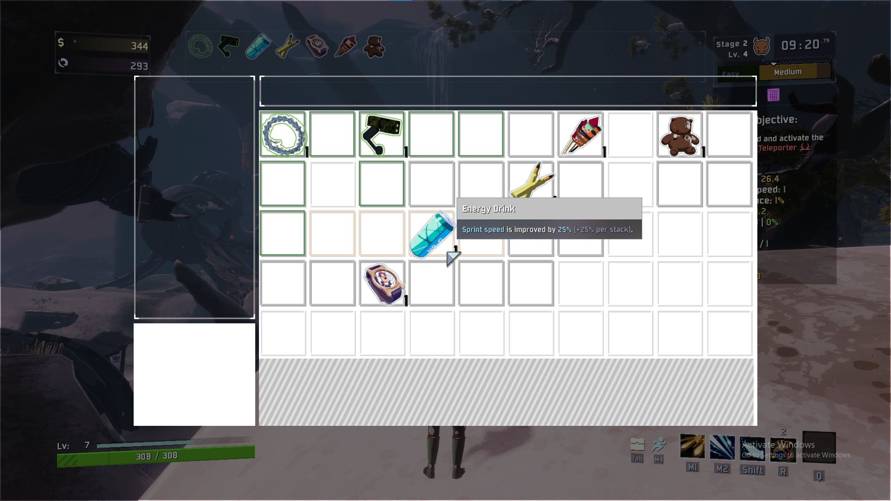
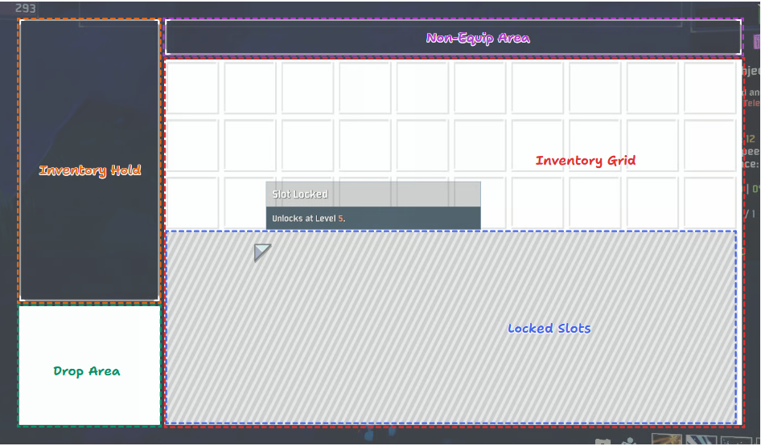
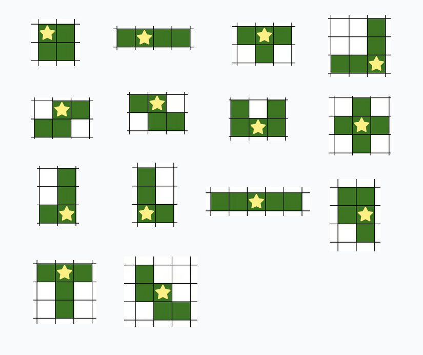

# R2InventoryArtifact

A mod adds an active inventory management system.

### Features

#### Grid Area
- When items are picked up, they are added to the `Inventory Grid` if there is space.
- [Configurable] Each item has a set number of stacks that can be maintained before a new element is created as well as a shape that it takes up on the grid. 
- Items can be moved around the `Inventory Grid` and rotated by pressing the `Rotate Item` key. 
- When starting a run, a portion of the grid is locked. Gaining Slots can be unlocked by increasing the player level. 

#### Hold Area
- `Droppable` items be moved bewteen the `Inventory Grid` and the `Hold Area`.
- If there is no space in the inventory when an item is picked up, then the item is added to the hold and the `Inventory HUD` is *forcebly* opened. 
- If the `Inventory HUD` is closed with items in the `Hold Area`, then they are forcebly dropped from the player.  

#### Drop Area
- `Droppable` items may by dropped by dragging them from either the `Hold Area` or the `Grid Area` to the `Drop Area`. 
- Only `Lunar` Teir and `Void` Tier items are deemed not `Droppable`.

#### Non Equip Area
- `Non-equippable Items` will appear in the `Non-Equip Area`. 
- Anything labled as `Consumed` along with `Regenerating Scrap` and `Sale Star` are deemed non-equippable. 

#### Keybindings 
- `E`: Open & Close / Toggle Inventory
- `Right Click`: Rotate Items in Inventory
> All Keybindngs are re-bindable in Options

## Item Configuration
- If there is a specific layout or stack amount for an item that is needed, you can edit `[plugin_folder]/Assets/item_data.json`. 
- The below fields are currently used by the mod: 
    - `[Key]`: This should match with the item name language token. 
    - `Node Origin`: This represents the nodes where the item is located on the grid. Each item has a relative root node at `(0, 0)`. Each node is represented by the object `{Row: [number], Count: [number]}`. 
    - `Max Stack Count`: The maximum number of stacks before a new element is created in the grid. 
    > ActiveOrigin is not currently used
- If the properties are not explicitly listed in the file, then it will be selected based off the item/equipment index and item tier. Below are the possible shape options: 

### Item Painter
- For easier bulk item configuration, visit the [Item Painter](https://kakumuo.github.io/R2InventoryArtifact/) site. 
#### How to Use
1. Enter the item's language token name in the search bar and select `Add` or select an existing item from the dropdown. 
The name entered in the search bar will be the item's language token when refrenced by the mod. (for custom items). 
2. Select the item from the sidebar
3. Select a paint palette from the bottom and use `left click` to paint tiles on the grid. Use `right click` to erase. Hit `ctrl+z` and `ctrl+y` to undo and redo. Note: The center of the area will always be set. 
4. Enter the item label and Max Stack count values in the Properties sidebar. 
5. Export the items to your clipboard and paste them in the `item_data.json` file or copy them to the clipboard and paste them directly. 

## Mod Support
This mod was designed to work with the base game's (and DLCs') items. 
Ideally it should by compatable with other mods, if there are any issues, let me know...

## Multiplayer
Ideally, this should work in multiplayer as each client has their own instance of the `Inventory HUD`. 

## References
As this is my first mod, I used the below mods as references: 
- [Better Command Menu](https://github.com/mries92/BetterCommandMenu/tree/master) - API Interfacing
- [Level Up Choices](https://github.com/karaeren/LevelUpChoices) - Codebase Structure,  UI & Player API
- [Looking Glass](https://github.com/Wet-Boys/LookingGlass) - UI API
- [Pressure Drop](https://github.com/itsschwer/pressure-drop) - Player API
- [RoR2-ForceItemsEqualShare](https://github.com/Mordrog/RoR2-ForceItemsEqualShare) - Potential Networking

## Note
- There is only mouse support at the moment
- If there are any bugs or things you would like to see added, let me know: `@foxfen64` on the Discord or open an issue on GitHub

# Pending Tasks
### Known Bugs
- Sometimes items in the Hold Area are dropped from the inventory, but not from the HUD, thus allowing items to be dropped multiple times
- ~~Item Painter returns nodes 'upside down'~~

### Todo
- Add custom sprites for item slots when they are occupied to better identify item boundaries
- Controller support
- Allow some config options to update UI without Run restart

### Brainstorming
- Player buffs depending on item orientation and adjacency to other items
- Drone Support
- Custom Inventory per Survivor